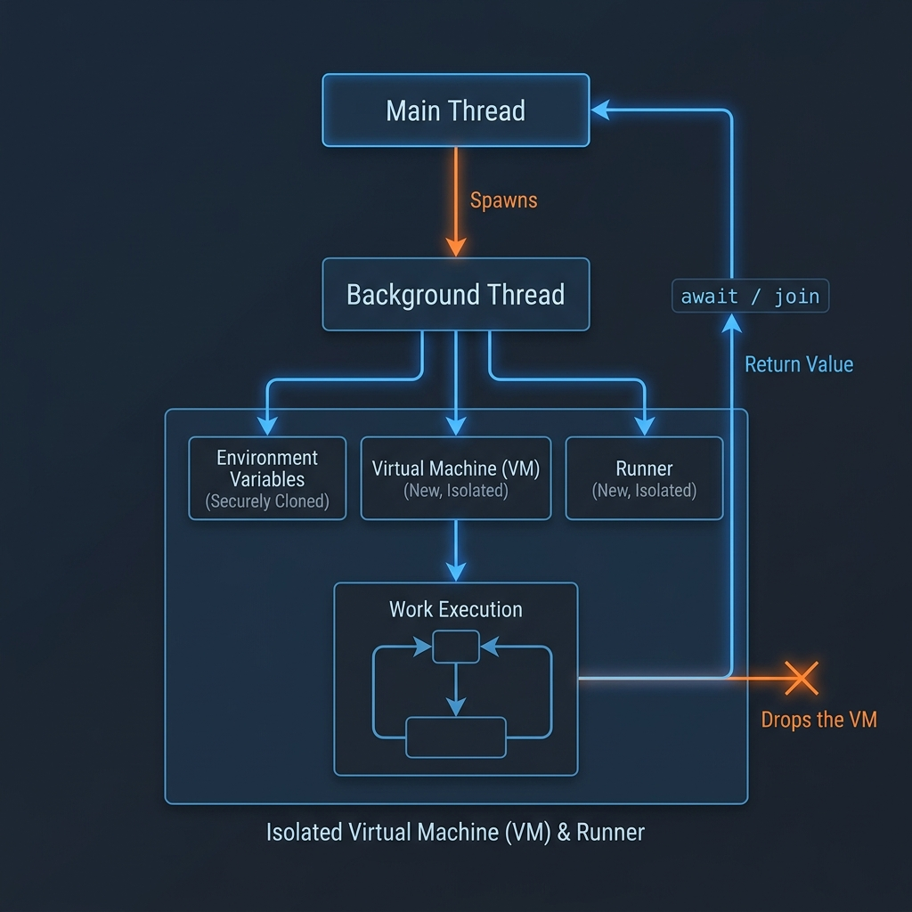

import { Aside, Tabs, TabItem } from '@astrojs/starlight/components';


Flame cleanly separates **I/O Concurrency** (`async`/`await`) from **Computational Multi-Core Concurrency** (`thread { ... }`).

---

## Architecture: Execution Model vs Concurrency Model

Rather than cloning interpreter instances per thread (which causes memory bloat and state divergence), Flame uses **Lexical Snapshot Isolation**:



1. **Multi-Core Workers**: Incoming network sockets and background workers execute in parallel across CPU cores.
2. **Atomic Memory Channels**: Results and event payloads are passed safely over lock-free message channels.
3. **Deterministic State**: Flame's engine evaluates tasks deterministically without mutex deadlock risks.

---

## Spawning Dedicated Compute Threads (`thread`)

To run CPU-intensive calculations in parallel on an independent physical CPU core:

```flame
import std.thread

print($"Main Thread ID: {thread.id()}")

let handle = thread {
    print($"Worker Thread ID: {thread.id()}")
        
    let mut sum = 0
    let mut i = 0
    while i < 50000000 {
        sum = sum + i
        i = i + 1
    }
    return sum
}

// Main thread continues executing without blocking...
print("Main thread is working...")

// Synchronize and receive the result
let result = await handle
print($"Worker computed result: {result}")
```

---

## Concurrency & Channels (`std.thread`)

Manage thread execution, sleep durations, and pass messages cleanly across concurrent threads using channels:

```flame
import std.thread

// Display the current OS thread identifier
println($"Active thread ID: {thread.id()}")

// Pause execution of the current thread for 200 milliseconds
thread.sleep(200)

// Yield execution time back to the operating system scheduler
thread.yield()

// Create an asynchronous communication channel
let (tx, rx) = thread.channel()

// Send and receive messages across thread channels
tx.send("Message across channel!")
let received = rx.recv()
println($"Received: {received}")
```
---

## Thread Safety & Panic Isolation

- **Panic Isolation**: If a compute thread encounters a runtime error or division-by-zero, the panic is trapped inside the thread boundary. Awaiting the handle resolves cleanly without crashing your main server.
- **Automatic Resource Cleanup**: RAII ensures all memory allocated within a worker thread is reclaimed immediately upon completion.
- **Graceful Shutdown**: The runtime monitors all active worker threads and waits for clean resolution before process exit.

---

## API Reference


### Threading (`std.thread`)

| Method | Arguments | Returns | Description |
| :--- | :--- | :--- | :--- |
| `thread.sleep` | `ms: Int` | `Nil` | Suspends thread execution for the specified number of milliseconds. |
| `thread.id` | *None* | `String` | Returns a formatted string representation of the active thread ID. |
| `thread.yield` | *None* | `Nil` | Yields the processor, allowing other threads on the OS to run. |
| `thread.channel` | *None* | `Tuple<Sender, Receiver>` | Creates a multi-producer, single-consumer communication channel. |
| `thread.spawn` | `callback: Function` | `ThreadHandler` | Spawns a background concurrent execution thread. |
