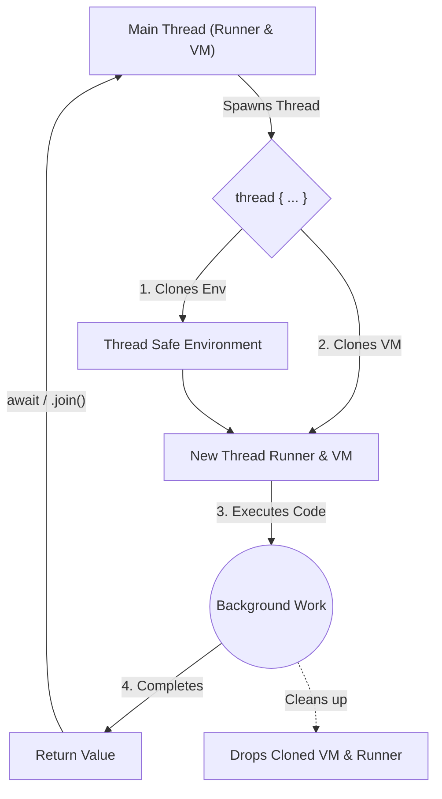

# Multithreading in Flame

Flame provides an intuitive and powerful concurrency model using threads. Background threads in Flame run entirely in parallel and are capable of fully utilizing multi-core CPUs. 

## Thread Creation

You can spawn a new thread using the `thread { ... }` block syntax. When you spawn a thread, it returns a **Thread Handler**, which you can use to wait for the thread to complete.

```flame
import std.thread

fn main() {
    print(thread.id()) // E.g., prints "ThreadId(1)" for the main thread

    let handle = thread {
        // Runs in a completely new background thread
        print(thread.id()) // E.g., prints "ThreadId(2)"
        
        thread.sleep(1000)
        return "Task Completed!"
    }

    // Do other work here...

    // Wait for the thread to finish and get its result
    let result = await handle 
    // OR using join(): let result = handle.join()
    
    print(result) // "Task Completed!"
}
```

## How Threads Work under the Hood


When a new thread is spawned, Flame does **not** share the same execution environment with the main thread (which prevents race conditions and data corruption). Instead, Flame completely isolates the thread. 

### Architecture

1. **New Environment (`Env`)**: The current variables and environment are cloned into a thread-safe atomic reference.
2. **Cloned Blaze VM and Runner**: Flame creates a brand new clone of the Blaze virtual machine and runner specifically for the thread.
3. **Execution**: The background thread executes the block of code using its isolated runner.
4. **Cleanup**: Once the thread finishes, it returns its value (or `Nil`). The cloned runner and Blaze VM are automatically dropped from memory, preventing memory leaks, and the value is passed back to the main thread.

### Visual Architecture



## Waiting for Threads and Memory Safety

You can wait for a thread to finish using two methods:
1. **`await` keyword**: Prefix the thread handle with `await` (e.g. `await handle`). This is the idiomatic way.
2. **`.join()` method**: Call `.join()` on the thread handle (e.g. `handle.join()`). 

Both methods will block the current execution context until the thread finishes and return its final value. If the thread encounters an error or panics, the join will return an error message.

> [!TIP]
> **What happens if you never call `.join()` or `await`?**
> Even if you spawn a thread and completely forget to wait for it, Flame is perfectly memory safe! The background thread's cloned `Env` (Environment) and `Runner` are automatically dropped from memory the exact moment the thread finishes its closure.
>
> Furthermore, right before your Flame program shuts down, the Blaze VM runs an internal `wait_for_all_threads()` system routine. This routine forcibly joins any orphaned or hanging background threads to ensure your program exits cleanly and no system resources are leaked.
