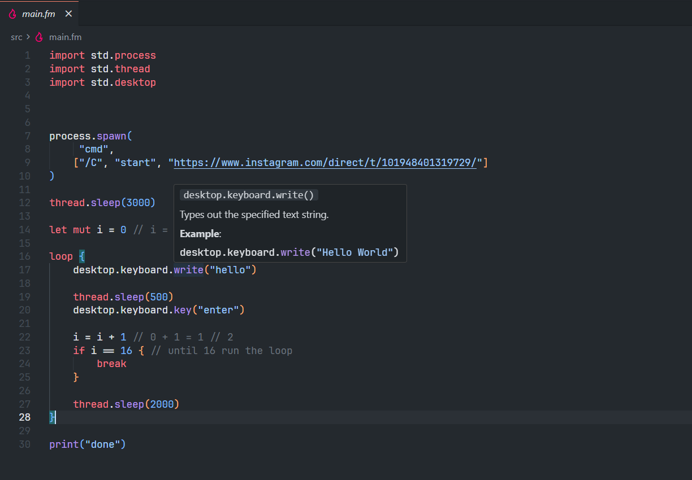

# Flame Language Support

Rich IDE syntax highlighting and configuration for the Flame programming language.

## Features

- Syntax highlighting for `.fm` and `.fmi` files.
- Language configuration (brackets, comments, etc.).
- File icons for Flame files.
- Rich IntelliSense and code suggestions with hover documentation.

## Repository

[GitHub Repository](https://github.com/shoya-129/flame/tree/main/flame-vscode-extension)

## License

ISC
